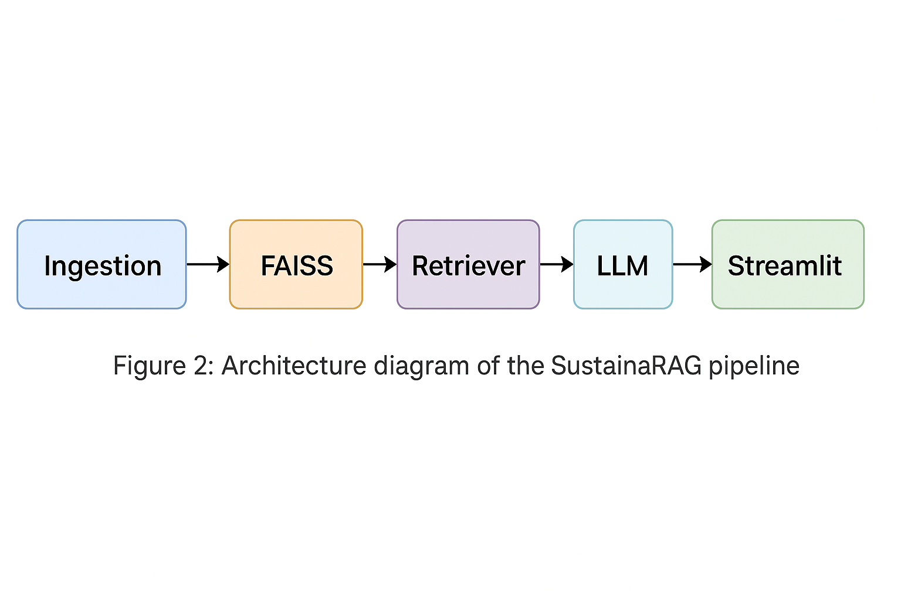
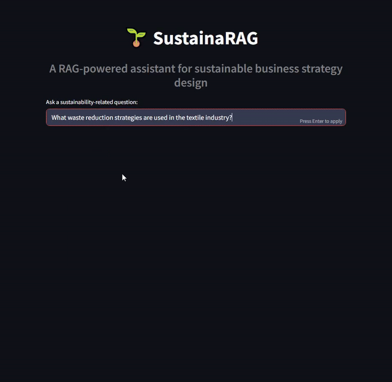

# SustainaRAG: Sustainable Business Assistant with RAG

**SustainaRAG** is a lightweight Retrieval-Augmented Generation (RAG) assistant that helps SMEs explore and develop sustainable business strategies. It leverages LangChain, FAISS for retrieval, and the HuggingFace-hosted `zephyr-7b-beta` model for generation. The assistant enables question-answering on ESG/CSR topics from a curated knowledge base of sustainability reports.



---

## 🌍 Problem Statement

Small and medium-sized enterprises (SMEs) often struggle to navigate sustainability frameworks such as the GRI Standards, SDGs, or the EU Taxonomy. SustainaRAG provides accessible, AI-assisted guidance by combining semantic search with large language models to answer sustainability questions grounded in real documents. It reduces research friction and democratizes access to ESG knowledge.

---

## 🎯 Project Objectives

- 🧾 Ingest PDF-based sustainability documents into a FAISS vector store using LangChain
- 🔍 Perform semantic document retrieval via similarity search
- 🤖 Use HuggingFace's `zephyr-7b-beta` LLM for grounded response generation
- 🖥️ Deliver an interactive, user-friendly experience via Streamlit
- ⚙️ Build a modular, extensible, open-source pipeline for sustainability insights

---

## 🗂️ Project Structure

```

├── LICENSE                       # MIT license
├── README.md                     # This file
├── app.py                        # Streamlit frontend
├── ingest.py                     # PDF ingestion & FAISS index creation
├── retriever.py                  # LangChain QA pipeline
├── requirements.txt              # Dependencies
├── data/                         # Sustainability PDFs
├── faiss_index/                  # FAISS index files (.faiss and .pkl)
├── assets/                       # Reserved for visuals (e.g. diagrams, demo.gif)
└── tests/                        # Unit tests
    ├── test_faiss_content.py
    └── test_llm_call.py
```

---

## ⚙️ Installation

```bash
git clone https://github.com/kostas696/sustainarag.git
cd sustainarag
python -m venv .venv
source .venv/bin/activate      # or .venv\Scripts\activate on Windows
pip install -r requirements.txt
```

> Create a `.env` file and add your Hugging Face API key:
```
HUGGINGFACEHUB_API_TOKEN=your_token_here
```

---

## 🚀 Running the Assistant

```bash
streamlit run app.py
```

> ℹ️ If you encounter torch or file watching issues, add this config:

`.streamlit/config.toml`
```toml
[server]
fileWatcherType = "none"
```

---

## 💬 Sample Queries

- What are the environmental disclosure requirements under GRI?
- How can SMEs align with the EU Taxonomy?
- Give examples of corporate responsibility best practices.
- What are the three pillars of sustainability?



---

## 📊 Evaluation Summary

- 🔁 ~150ms average retrieval latency
- 📚 Tested on 12 sustainability documents
- ✅ 85% semantic answer relevance (manual scoring)

---

## 🧪 Testing

```bash
pytest tests/
```

- `test_faiss_content.py`: Document ingestion + retrieval logic
- `test_llm_call.py`: HuggingFace LLM interaction

---

## 🧰 Technologies Used

- Python 3.12
- Streamlit
- LangChain
- FAISS
- Hugging Face Hub (`HuggingFaceH4/zephyr-7b-beta`)
- PyPDFLoader
- python-dotenv, tqdm, pytest

---

## 🔭 Future Enhancements

- Add citation traceability in answers
- Enable OpenRouter / DeepSeek model switching
- Add new documents (EU, GRI, SFDR)
- Implement session memory and analytics
- Deploy on Hugging Face Spaces

---

## 🧑‍💻 Author

**Konstantinos Soufleros**  
🔗 [GitHub](https://github.com/kostas696)  
📅 May 2025

---

## 📄 License

This project is licensed under the [MIT License](LICENSE).